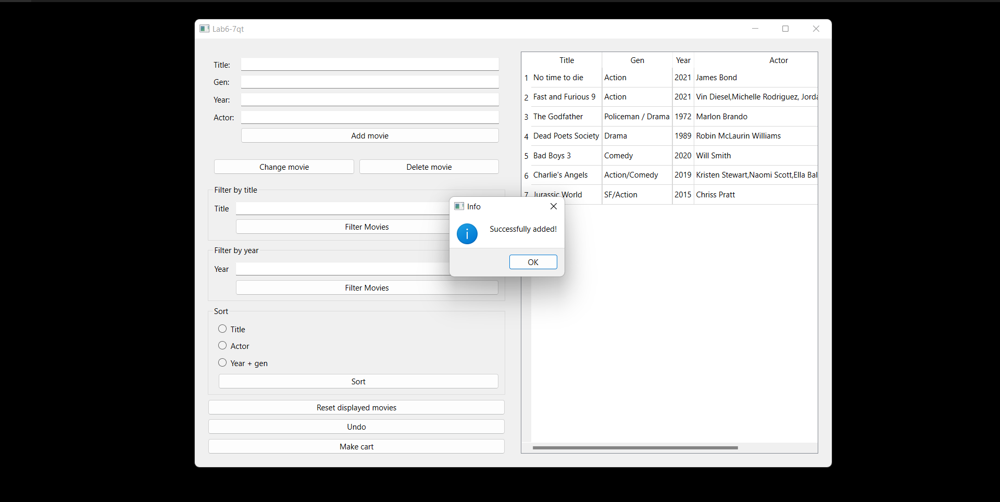

# Movies-Homework

A project from college where I learned to apply oop principles and write code that is easy to scale and maintain. 

The project uses Qt 6.3.0 for the graphical user interface

You can add a new movie to the list very easily.

If the movie parameters are valid, the movie is added.

If the movie parameters are not valid, the movie is not added and an error form is displayed

You can change an existing movie. The movie will change only if there is a movie with the old parameters and the new set of parameters are suitable for a movie

You can delete a movie. If the chosen movie does not appear in the list, there will be a message form that will inform the user that there is no movie with chosen parameters.

You can undo each action that modified the list (until you get the list from opening the app)
 

You can filter the displayed movies from the right list by title or by year.

You can see the movie list sorted by title or by the actor or by year+gen

You can create a cart and add a chosen by title movie (like a shopping cart)

You can also add random movies. You can export the cart content in an external file.

You can "draw the cart". The draw cart will open a new window each time it is pressed. 
All windows are updated with each action on the cart in an efficient way.

